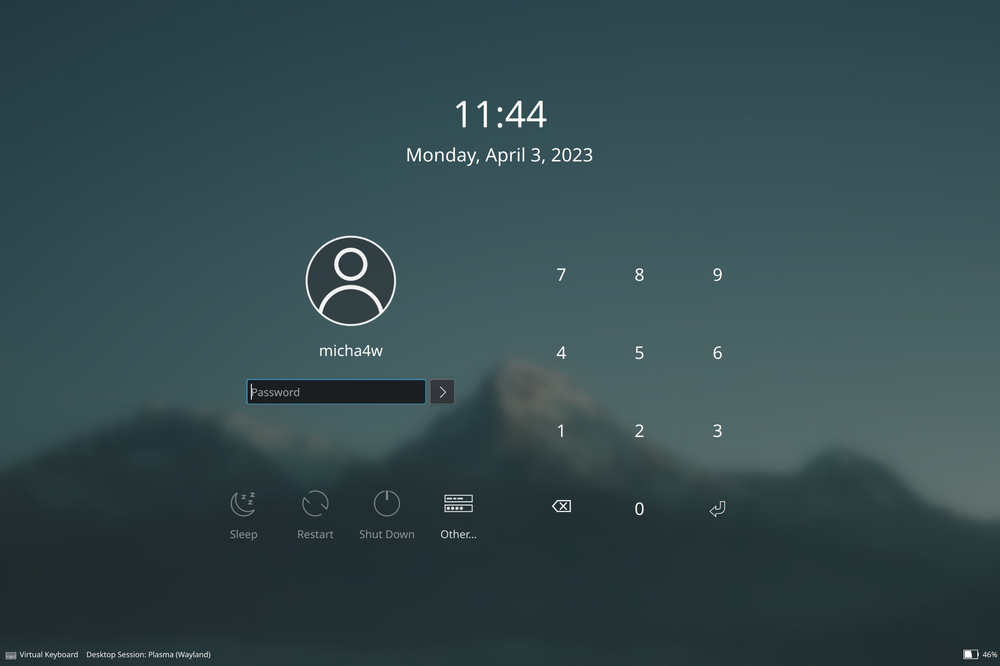

# kde-breeze-pin-sddm
An edited version of the Breeze SDDM/Lock Screen that includes a number pin input.

Useful for touchscreen devices if you don't like the virtual keyboard.
You should use a different password for you sudo and the login pin. Checkout [this](https://blog.fancypi.cn/blog/pin_login_in_kde.html) as an example.



## Installation
There is not yet an official theme, so you need to patch the theme together manually:
```sh
# as root
mv /usr/share/sddm/themes/breeze/Main.qml /usr/share/sddm/themes/breeze/Main.qml.bac
cp Main.qml /usr/share/sddm/themes/breeze/Main.qml

mv /usr/share/plasma/look-and-feel/org.kde.breeze.desktop/contents/lockscreen/LockScreenUi.qml /usr/share/plasma/look-and-feel/org.kde.breeze.desktop/contents/lockscreen/LockScreenUi.qml.bac
cp LockScreenUi.qml /usr/share/plasma/look-and-feel/org.kde.breeze.desktop/contents/lockscreen/LockScreenUi.qml  
```
